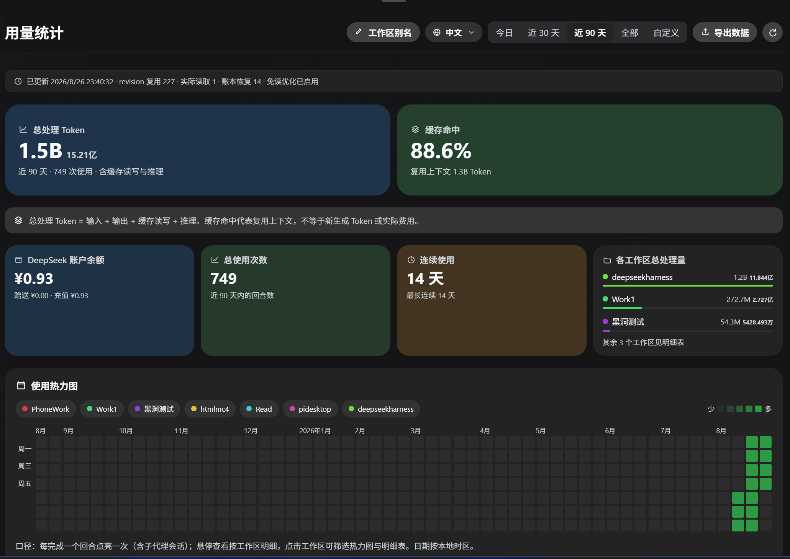
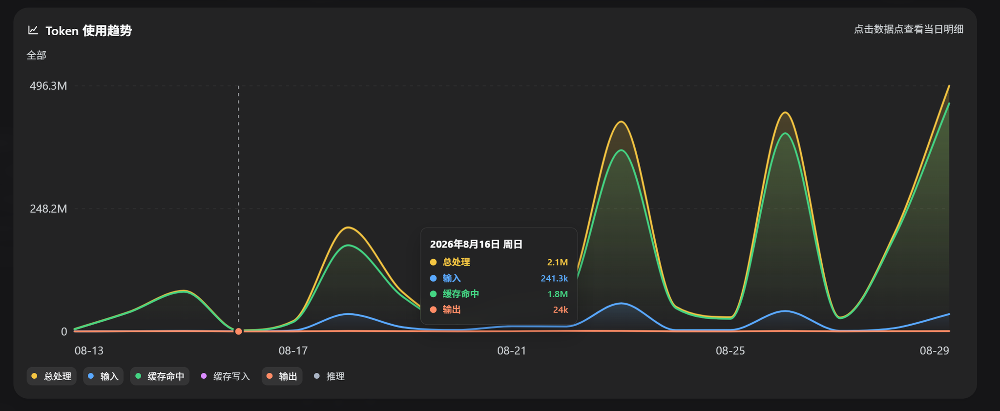

# dsh-all-usage

[中文](#中文) · [English](#english)

## 中文

DeepSeek Harness 全量用量看板：按模型、供应商、工作区和时间范围分析 Token、缓存与账户余额。

### 功能

- **热力图**：53 周使用热力图；按工作区筛选并查看每日回合与 Token 明细
- **模型统计**：支持混合查看、按模型合并、按供应商汇总三种维度，展示调用次数、各类 Token 与缓存命中率
- **摘要与工作区**：Token 用量、缓存命中、账户余额、连续使用、工作区 Token 分布和明细
- **导出**：按当前时间范围和模型聚合方式导出 CSV
- **时间范围**：今日、近 30 天、近 90 天、全部
- **工作区别名**：在侧栏入口打开看板后管理，持久化保存到 $DSH_HOME/storages 的 KV 单元 `all-usage-aliases`

### 截图 / Screenshots

### 安装

本插件是标准的 DSH 社区插件包（声明 `dsh.bundle` manifest + web client 半），数据全部来自持久化会话日志，安装后自动回填历史。

#### 官方插件命令（推荐）

~~~bash
dsh plugin --profile web add github:ParticleLight/dsh-all-usage
~~~

安装后刷新页面即可，无需手动改配置、无需重启。

#### 手动注册（本地包）

1. 把本目录放入任意位置，并在 $DSH_HOME/profiles/node_modules/ 下创建指向本目录的符号链接（Windows 用 junction）：

   ~~~powershell
   New-Item -ItemType Junction -Path (Join-Path $env:DSH_HOME 'profiles/node_modules/dsh-all-usage') -Target '<本目录绝对路径>'
   ~~~

2. 在 $DSH_HOME/profiles/web/cordis.patch.yml 添加一行：

   ~~~yaml
   - insert:
       - id: all-usage
         name: dsh-all-usage
   ~~~

用户 patch 层会被热重载：保存后刷新页面即可。

### 架构

- **Host 半**（`lib/index.js`）：扫描持久化会话日志聚合用量（`turn/end` + `assistant/message.usage`），监听 `session/event` 实时折叠；通过 `webServer` 服务注册数据路由：
  - `GET /api/all-usage` — 统计快照
  - `GET /api/all-usage/balance?force=1` — 账户余额（复用 `llm-deepseek` 的 API Key 配置）
  - `POST /api/all-usage/alias` — 设置工作区别名
- **Client 半**（`lib/client.js`）：`window.__ModuleLoader__` 工厂格式的浏览器 bundle，注册侧边栏「用量统计」入口（`sidebar.footer.action` 槽位）。

### 数据说明

- 使用次数与 Token 全部来自 DSH 持久化会话日志，插件激活时会自动回填全部历史，插件卸载/重启后数据不丢
- 同一会话的同一 `turn / step` 只保留一份最终 usage；重试或替换消息会替换旧贡献，不重复累计
- 看板中的总处理量 = 输入 + 输出 + 缓存读写 + 推理；缓存命中表示复用的上下文 Token，不等于新生成 Token 或实际费用
- 余额查询走 DeepSeek 官方 `/user/balance` 接口；未配置 API Key 时卡片显示引导文案
- 仅统计能归属到已注册工作区（按会话 cwd 匹配）的会话

### 开发

- 修改 `lib/index.js` / `lib/client.js` 后刷新页面即可（client bundle 随页面加载）；host 半改动通过重启 DSH 生效
- 插件包无第三方依赖：host 半只使用 Cordis 服务，client 半只使用 runtime 提供的 React 模块

## English

A full usage dashboard for DeepSeek Harness. Analyze tokens, cache behavior, account balance, and activity by model, provider, workspace, and time range.

### Features

- **Heatmap**: a 53-week activity heatmap with workspace filters and daily turn/token details
- **Model analytics**: mixed view, model-merged view, and provider summary with calls, token categories, and cache hit rate
- **Summary and workspaces**: processed tokens, cache hits, account balance, usage streaks, workspace distribution, and details
- **CSV export**: export data using the selected time range and aggregation mode
- **Time ranges**: today, last 30 days, last 90 days, or all time
- **Workspace aliases**: manage aliases from the sidebar dashboard; values persist in the $DSH_HOME/storages KV cell `all-usage-aliases`

### Installation

This is a standard DSH community bundle. It declares a `dsh.bundle` manifest and a web client, and backfills its data from persisted session logs after installation.

#### Official plugin command (recommended)

~~~bash
dsh plugin --profile web add github:ParticleLight/dsh-all-usage
~~~

Refresh the page after installation. No manual configuration or restart is required.

#### Manual local registration

1. Place this directory anywhere and create a symlink to it under $DSH_HOME/profiles/node_modules/ (use a junction on Windows):

   ~~~powershell
   New-Item -ItemType Junction -Path (Join-Path $env:DSH_HOME 'profiles/node_modules/dsh-all-usage') -Target '<absolute plugin path>'
   ~~~

2. Add this entry to $DSH_HOME/profiles/web/cordis.patch.yml:

   ~~~yaml
   - insert:
       - id: all-usage
         name: dsh-all-usage
   ~~~

The profile patch layer hot-reloads; save the file and refresh the page.

### Architecture

- **Host** (`lib/index.js`): aggregates persisted session logs (`turn/end` and `assistant/message.usage`), folds live `session/event` updates, and exposes data routes through `webServer`:
  - `GET /api/all-usage` — usage snapshot
  - `GET /api/all-usage/balance?force=1` — account balance using the configured `llm-deepseek` API key
  - `POST /api/all-usage/alias` — update workspace aliases
- **Client** (`lib/client.js`): a `window.__ModuleLoader__` browser bundle that registers the “Usage statistics” sidebar entry through the `sidebar.footer.action` slot.

### Data semantics

- All calls and tokens come from persisted DSH session logs; historical data is backfilled when the plugin activates and survives reloads or uninstall/reinstall cycles
- For each session and logical `turn / step`, only the final usage contribution is kept; retries or replaced messages do not double-count
- Processed tokens = input + output + cache read/write + reasoning; a cache hit means reused context, not newly generated tokens or actual cost
- Balance data comes from DeepSeek’s official `/user/balance` endpoint; the card shows guidance when no API key is configured
- Only sessions that can be mapped to a registered workspace by their working directory are included

### Development

- After editing `lib/index.js` or `lib/client.js`, refresh the page (the client bundle loads with the page); host changes require restarting DSH
- The plugin has no third-party package dependencies: the host uses Cordis services and the client uses the runtime-provided React module

## License / 许可证

MIT
